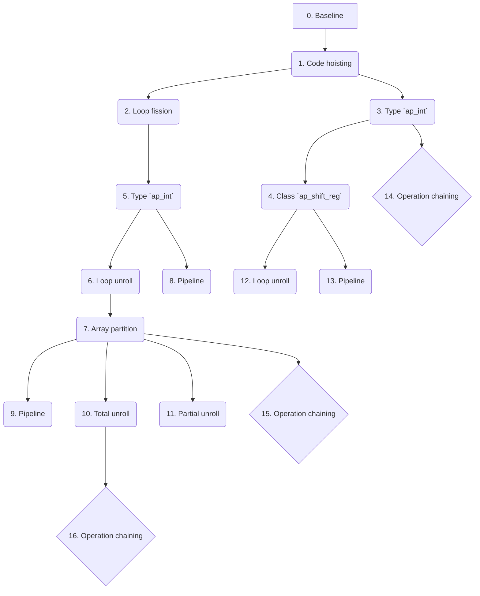

# HLS_projects
## ToDoList
- [ ] VHDL simulation time automatic grab from hls_cosim.rpt
- [ ] TB C SpMV using normale Matrix-Vector multiplication

## Projects structure
### Report generation directories
```markdown
.
├── build
│   ├── <PROJECT_NAME>
│   │   ├── <COMP_VERSION>
│   │   │   ├── vivado.log
│   │   │   └── vivado_prj
│   │   │       ├── vivado_prj.runs
│   │   │       │   ├── <COMP_NAME>_0_synth_1
│   │   │       │   │   ├── <COMP_NAME>_0_utilization_synth.rpt
│   │   │       │   │   └── runme.log
│   │   │       │   └── synth_1
│   │   │       │       ├── <COMP_NAME>_0_sv_utilization_synth.rpt
│   │   │       │       └── runme.log
│   │   │       └── vivado_prj.sim
│   │   │           └── sim_1
│   │   │               └── synth
│   │   │                   └── timing
│   │   │                       └── xsim
│   │   │                           ├── <COMP_NAME>_tb_time_synth.wdb
│   │   │                           └── simulate.log
│   │   └── ...
│   └── ...
└── projects
    ├── <PROJECT_NAME>
    │    ├── <COMP_VERSION>
    │    │   └── <COMP_VERSION>_script
    │    │       ├── hls
    │    │       │   ├── csim
    │    │       │   │   └── report
    │    │       │   │       └── <COMP_NAME>_csim.log
    │    │       │   ├── sim
    │    │       │   │   ├── report
    │    │       │   │   │   └── <COMP_NAME>_cosim.rpt
    │    │       │   │   └── verilog
    │    │       │   │       ├── <COMP_NAME>.wcfg
    │    │       │   │       ├── <COMP_NAME>.wdb
    │    │       │   │       └── <COMP_NAME>_dataflow_ana.wcfg
    │    │       │   └── syn
    │    │       │       └── report
    │    │       │           ├── csynth.rpt
    │    │       │           ├── csynth_design_size.rpt
    │    │       │           └── <COMP_NAME>_csynth.rpt
    │    │       └── logs
    │    │           ├── <COMP_VERSION>_script.steps.log
    │    │           ├── hls_compile.log
    │    │           ├── hls_run_cosim.log
    │    │           ├── hls_run_csim.log
    │    │           └── hls_run_package.log
    │    └── ...
    └── ...
```

### Report saving directories
```markdown
.
└── reports
    ├── <PROJECT_NAME>
    │   ├── <COMP_VERSION>
    │   │   ├── hls
    │   │   │   ├── csim
    │   │   │   │   ├── hls_run_csim.log
    │   │   │   │   └── <COMP_NAME>_csim.log
    │   │   │   ├── sim
    │   │   │   │   ├── hls_run_cosim.log
    │   │   │   │   ├── <COMP_NAME>_cosim.rpt
    │   │   │   │   └── waveform
    │   │   │   │       ├── <COMP_NAME>.wcfg
    │   │   │   │       ├── <COMP_NAME>.wdb
    │   │   │   │       └── <COMP_NAME>_dataflow_ana.wcfg
    │   │   │   ├── syn
    │   │   │   │   ├── csynth.rpt
    │   │   │   │   ├── csynth_design_size.rpt
    │   │   │   │   ├── hls_compile.log
    │   │   │   │   ├── <COMP_NAME>.verbose.sched.rpt
    │   │   │   │   └── <COMP_NAME>_csynth.rpt
    │   │   │   ├── impl
    │   │   │   │   └── hls_run_package.log
    │   │   │   └── <COMP_VERSION>_script.steps.log
    │   │   └── vivado
    │   │       ├── vivado.log
    │   │       ├── power
    │   │       │   ├── <COMP_NAME>_post-synth_power_report.txt
    │   │       │   ├── <COMP_NAME>_post-synth_power_report.xml
    │   │       │   └── <COMP_NAME>_post-synth_power_report.rpx
    │   │       ├── synth_ooc
    │   │       │   ├── <COMP_NAME>_0_utilization_synth.rpt
    │   │       │   └── runme.log                                   (from "<COMP_NAME>_0_synth_1/")
    │   │       ├── synth
    │   │       │   ├── <COMP_NAME>_0_sv_utilization_synth.rpt
    │   │       │   └── runme.log                                   (from "synth_1/")
    │   │       └── sim
    │   │           └── post-synth_timing
    │   │               ├── <COMP_NAME>_tb_time_synth.wdb
    │   │               └── simulate.log
    │   ├── ...
    │   ├── <COMP_VERSION>_clk
    │   │   ├── <CLK_VAL>
    │   │   │   └── hls
    │   │   │       ├── syn
    │   │   │       │   ├── csynth.rpt
    │   │   │       │   ├── csynth_design_size.rpt
    │   │   │       │   ├── hls_compile.log
    │   │   │       │   ├── <COMP_NAME>.verbose.sched.rpt
    │   │   │       │   └── <COMP_NAME>_csynth.rpt
    │   │   │       └── <COMP_VERSION>_script.steps.log
    │   │   └── ...
    │   └── ...
    └── ...
```

# Project-01 (FIR)
## Components revisions
### Commands
0. Baseline: `.\scripts\workflow.bat project01_FIR 00_baseline fir`
1. Code hoisting: `.\scripts\workflow.bat project01_FIR 01_code-hoisting fir /tb project01_FIR_00_baseline_tb /clk project01_FIR_00_baseline_clk`
2. Loop fission: `.\scripts\workflow.bat project01_FIR 02_loop-fission fir /tb project01_FIR_00_baseline_tb /clk project01_FIR_00_baseline_clk`
3. AP_int: `.\scripts\workflow.bat project01_FIR 03_ap-int fir /clk project01_FIR_00_baseline_clk`
4. AP_shift_reg: `.\scripts\workflow.bat project01_FIR 04_ap-shift-reg fir /tb project01_FIR_03_ap-int_tb /clk project01_FIR_00_baseline_clk`
5. Loop fission + AP_int: `.\scripts\workflow.bat project01_FIR 05_loop-fission-ap-int fir /tb project01_FIR_03_ap-int_tb /clk project01_FIR_00_baseline_clk`
6. Loop fission + unroll: `.\scripts\workflow.bat project01_FIR 06_loop-fission-unroll fir /tb project01_FIR_03_ap-int_tb /clk project01_FIR_00_baseline_clk`
7. Loop fission + array partition: `.\scripts\workflow.bat project01_FIR 07_loop-fission-array-partition fir /tb project01_FIR_03_ap-int_tb /clk project01_FIR_00_baseline_clk`
8. Loop fission + pipeline: `.\scripts\workflow.bat project01_FIR 08_loop-fission-pipeline fir /tb project01_FIR_03_ap-int_tb /clk project01_FIR_00_baseline_clk`
9. Loop fission + unroll + pipeline: `.\scripts\workflow.bat project01_FIR 09_loop-fission-unroll-pipeline fir /tb project01_FIR_03_ap-int_tb /clk project01_FIR_00_baseline_clk`
10. Loop fission + total unroll: `.\scripts\workflow.bat project01_FIR 10_total-unroll fir /tb project01_FIR_03_ap-int_tb /clk project01_FIR_00_baseline_clk`
11. Loop fission + partial unroll: `.\scripts\workflow.bat project01_FIR 11_partial-unroll fir /tb project01_FIR_03_ap-int_tb /clk project01_FIR_00_baseline_clk`
12. Unroll: `.\scripts\workflow.bat project01_FIR 12_unroll fir /tb project01_FIR_03_ap-int_tb /clk project01_FIR_00_baseline_clk`
13. Pipeline: `.\scripts\workflow.bat project01_FIR 13_pipeline fir /tb project01_FIR_03_ap-int_tb /clk project01_FIR_00_baseline_clk`

- `.\scripts\workflow.bat project01_FIR 03_ap-int fir /wf clk ` + `<CLK_VAL>`
- `.\scripts\workflow.bat project01_FIR 07_loop-fission-array-partition fir /wf clk ` + `<CLK_VAL>`
- `.\scripts\workflow.bat project01_FIR 10_total-unroll fir /wf clk ` + `<CLK_VAL>`

### Revisions graph


# Project-02 (SpMV)
## Components revisions
### Commands
0. Baseline: `.\scripts\workflow.bat project02_SpMV 00_baseline spmv`
    - Baseline tripcount: `.\scripts\workflow.bat project02_SpMV 00_baseline-tripcount spmv /tb project02_SpMV_00_baseline_tb /clk project02_SpMV_00_baseline_clk`
1. Pipeline L2: `.\scripts\workflow.bat project02_SpMV 01_pipeline-L2 spmv /tb project02_SpMV_00_baseline_tb /clk project02_SpMV_00_baseline_clk`
2. Pipeline L1: `.\scripts\workflow.bat project02_SpMV 02_pipeline-L1 spmv /tb project02_SpMV_00_baseline_tb /clk project02_SpMV_00_baseline_clk`
3. Unroll-2 L1: `.\scripts\workflow.bat project02_SpMV 03_unroll-2-L1 spmv /tb project02_SpMV_00_baseline_tb /clk project02_SpMV_00_baseline_clk`
4. Pipeline + Unroll-2 L2: `.\scripts\workflow.bat project02_SpMV 04_pipeline-unroll-2-L2 spmv /clk project02_SpMV_00_baseline_clk`
5. Pipeline + Unroll-2 + Cyclic-2 L2: `.\scripts\workflow.bat project02_SpMV 05_pipeline-unroll-2-cyclic-2-L2 spmv /clk project02_SpMV_00_baseline_clk`
6. Pipeline + Unroll-2 + Cyclic-2 (v2) L2: `.\scripts\workflow.bat project02_SpMV 06_pipeline-unroll-2-cyclic-2-v2-L2 spmv /clk project02_SpMV_00_baseline_clk`
7. Pipeline + Unroll-2 + Cyclic-2 (v3) L2: `.\scripts\workflow.bat project02_SpMV 07_pipeline-unroll-2-cyclic-2-v3-L2 spmv /clk project02_SpMV_00_baseline_clk`
8. Pipeline + Unroll-4 + Cyclic-2 (v3) L2: `.\scripts\workflow.bat project02_SpMV 08_pipeline-unroll-4-cyclic-2-v3-L2 spmv /clk project02_SpMV_00_baseline_clk`
9. Partial sums: `.\scripts\workflow.bat project02_SpMV 09_partial-sums spmv /clk project02_SpMV_00_baseline_clk`
   -   Partial sums (no partition): `.\scripts\workflow.bat project02_SpMV 09_partial-sums-no_partitioning spmv /clk project02_SpMV_00_baseline_clk`

### Revisions graph
```mermaid
flowchart TD
    0[0. Baseline] -->
```
