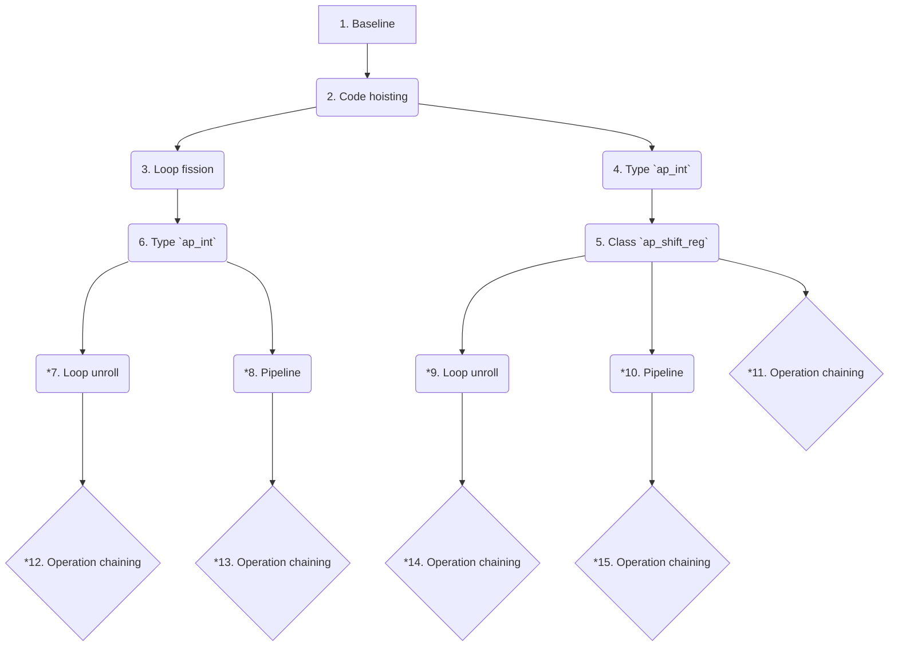

# HLS_projects
## ToDoList
- [ ] VHDL simulation time automatic grab from hls_cosim.rpt
- [ ] Add structure of clk reports

## Projects structure
### Report generation directories
```markdown
.
├── build
│   ├── <PROJECT_NAME>
│   │   ├── <COMP_VERSION>
│   │   │   ├── vivado.log
│   │   │   └── vivado_prj
│   │   │       ├── vivado_prj.runs
│   │   │       │   ├── <COMP_NAME>_0_synth_1
│   │   │       │   │   ├── <COMP_NAME>_0_utilization_synth.rpt
│   │   │       │   │   └── runme.log
│   │   │       │   └── synth_1
│   │   │       │       ├── <COMP_NAME>_0_sv_utilization_synth.rpt
│   │   │       │       └── runme.log
│   │   │       └── vivado_prj.sim
│   │   │           └── sim_1
│   │   │               └── synth
│   │   │                   └── timing
│   │   │                       └── xsim
│   │   │                           ├── <COMP_NAME>_tb_time_synth.wdb
│   │   │                           └── simulate.log
│   │   └── ...
│   └── ...
└── projects
    ├── <PROJECT_NAME>
    │    ├── <COMP_VERSION>
    │    │   └── <COMP_VERSION>_script
    │    │       ├── hls
    │    │       │   ├── csim
    │    │       │   │   └── report
    │    │       │   │       └── <COMP_NAME>_csim.log
    │    │       │   ├── sim
    │    │       │   │   ├── report
    │    │       │   │   │   └── <COMP_NAME>_cosim.rpt
    │    │       │   │   └── verilog
    │    │       │   │       ├── <COMP_NAME>.wcfg
    │    │       │   │       ├── <COMP_NAME>.wdb
    │    │       │   │       └── <COMP_NAME>_dataflow_ana.wcfg
    │    │       │   └── syn
    │    │       │       └── report
    │    │       │           ├── csynth.rpt
    │    │       │           ├── csynth_design_size.rpt
    │    │       │           └── <COMP_NAME>_csynth.rpt
    │    │       ├── logs
    │    │       │   ├── <COMP_VERSION>_script.steps.log
    │    │       │   ├── hls_compile.log
    │    │       │   ├── hls_run_cosim.log
    │    │       │   ├── hls_run_csim.log
    │    │       │   └── hls_run_package.log
    │    │       └── reports
    │    │           ├── hls_compile.rpt
    │    │           └── hls_cosim.rpt
    │    └── ...
    └── ...
```

### Report saving directories
```markdown
.
└── reports
    ├── <PROJECT_NAME>
    │   ├── <COMP_VERSION>
    │   │   ├── hls
    │   │   │   ├── csim
    │   │   │   │   ├── hls_run_csim.log
    │   │   │   │   └── <COMP_NAME>_csim.log
    │   │   │   ├── sim
    │   │   │   │   ├── hls_run_cosim.log
    │   │   │   │   ├── hls_cosim.rpt
    │   │   │   │   ├── <COMP_NAME>_cosim.rpt
    │   │   │   │   └── waveform
    │   │   │   │       ├── <COMP_NAME>.wcfg
    │   │   │   │       ├── <COMP_NAME>.wdb
    │   │   │   │       └── <COMP_NAME>_dataflow_ana.wcfg
    │   │   │   ├── syn
    │   │   │   │   ├── csynth.rpt
    │   │   │   │   ├── csynth_design_size.rpt
    │   │   │   │   ├── hls_compile.log
    │   │   │   │   ├── hls_compile.rpt
    │   │   │   │   └── <COMP_NAME>_csynth.rpt
    │   │   │   ├── impl
    │   │   │   │   └── hls_run_package.log
    │   │   │   └── <COMP_VERSION>_script.steps.log
    │   │   └── vivado
    │   │       ├── vivado.log
    │   │       ├── power
    │   │       │   ├── <COMP_NAME>_post-synth_power_report.txt
    │   │       │   ├── <COMP_NAME>_post-synth_power_report.xml
    │   │       │   └── <COMP_NAME>_post-synth_power_report.rpx
    │   │       ├── synth_ooc
    │   │       │   ├── <COMP_NAME>_0_utilization_synth.rpt
    │   │       │   └── runme.log                                   (from "<COMP_NAME>_0_synth_1/")
    │   │       ├── synth
    │   │       │   ├── <COMP_NAME>_0_sv_utilization_synth.rpt
    │   │       │   └── runme.log                                   (from "synth_1/")
    │   │       └── sim
    │   │           └── post-synth_timing
    │   │               ├── <COMP_NAME>_tb_time_synth.wdb
    │   │               └── simulate.log
    │   └── ...
    └── ...
```

# Project-01 (FIR)
## Components revisions
### Commands
1. `.\scripts\workflow.bat project01_FIR fir_baseline fir`
2. `.\scripts\workflow.bat project01_FIR fir_code-hoisting fir /tb project01_FIR_fir_baseline_tb /clk project01_FIR_fir_baseline_clk`
3. `.\scripts\workflow.bat project01_FIR fir_loop-fission fir /tb project01_FIR_fir_baseline_tb /clk project01_FIR_fir_baseline_clk`
4. `.\scripts\workflow.bat project01_FIR fir_ap-int fir /clk project01_FIR_fir_baseline_clk`
5. `.\scripts\workflow.bat project01_FIR fir_ap-shift-reg fir /tb project01_FIR_fir_ap-int_tb /clk project01_FIR_fir_baseline_clk`
6. `.\scripts\workflow.bat project01_FIR fir_loop-fission-ap-int fir /tb project01_FIR_fir_ap-int_tb /clk project01_FIR_fir_baseline_clk`
7. ``
8. ``
9. ``
10. ``
11. ``
12. ``
13. ``
14. ``
15. ``
16. ``

- `.\scripts\workflow.bat project01_FIR fir_ap-int fir /wf clk ` + `<CLK_VAL>`

### Revisions graph


# Project-02 (SpMV)
TODO
